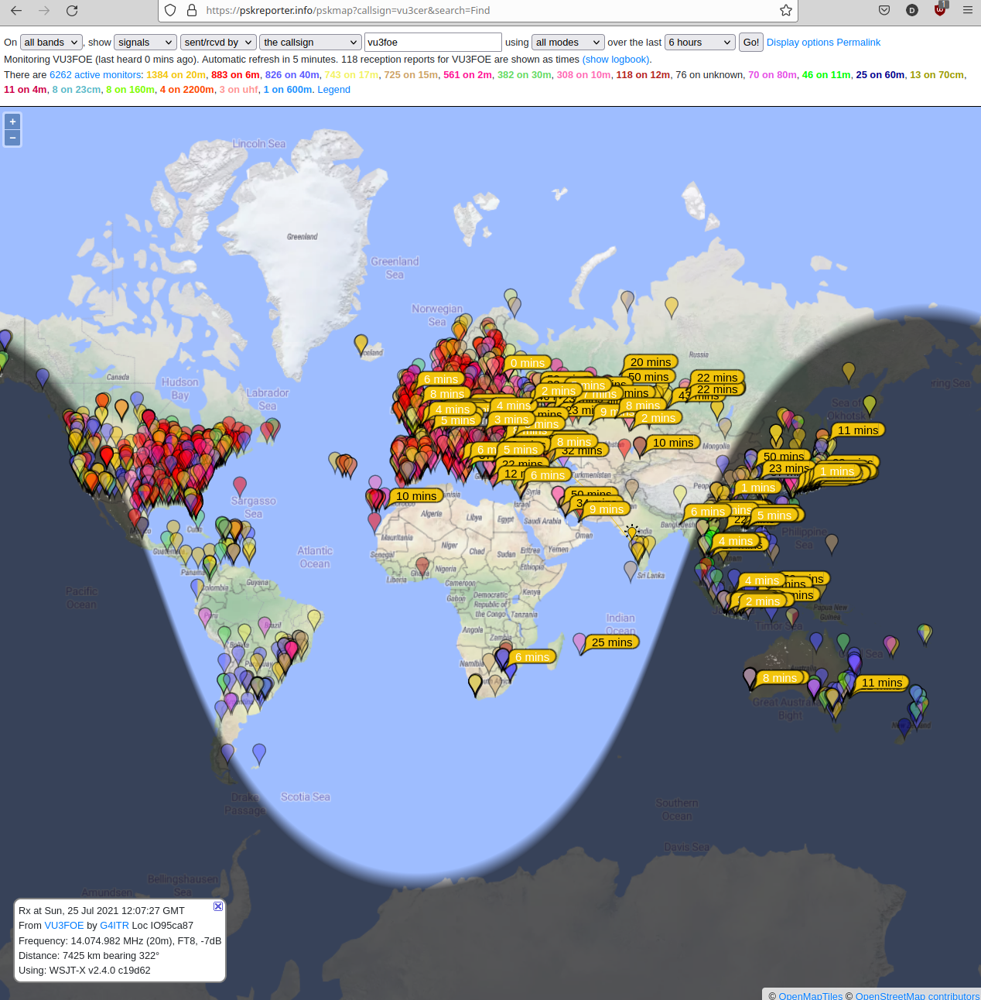
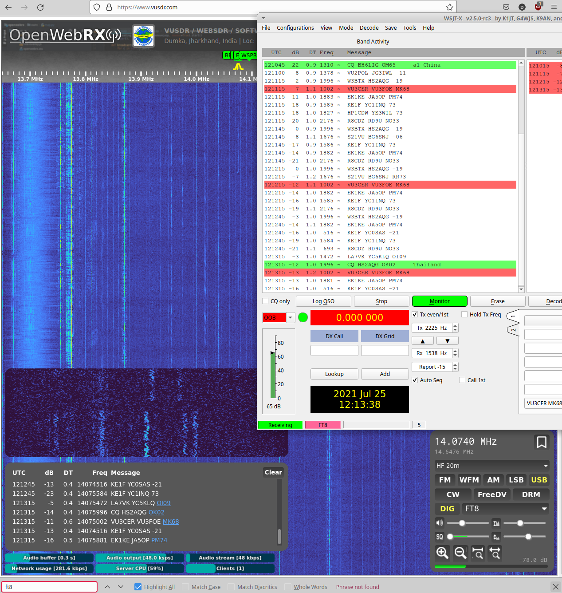
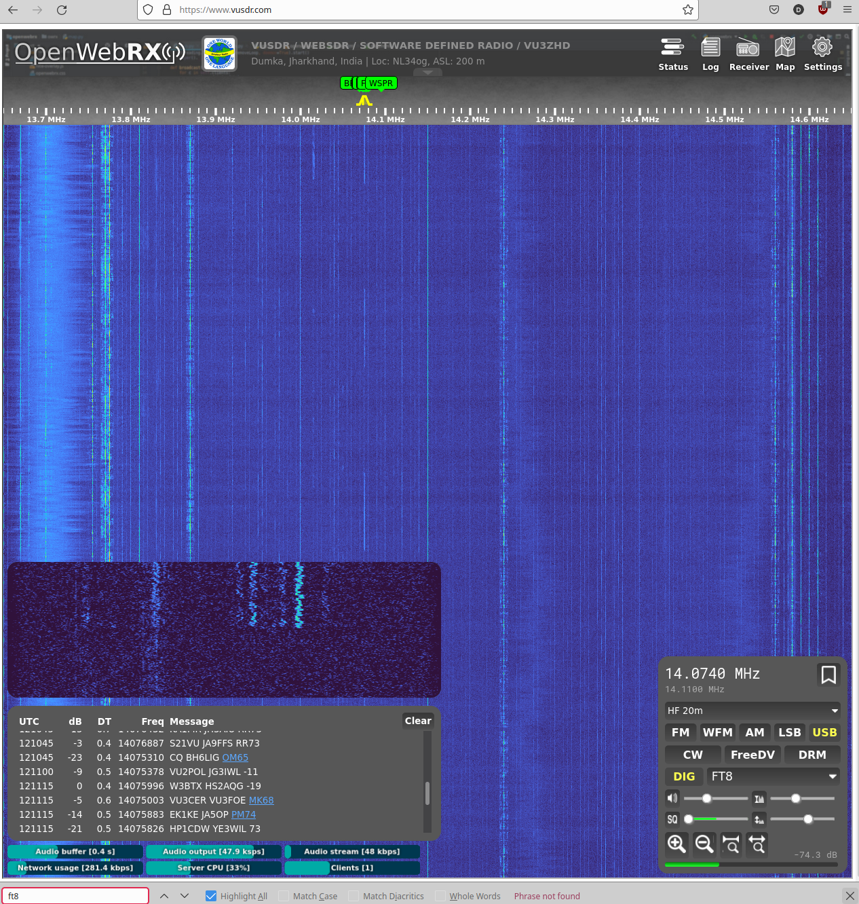
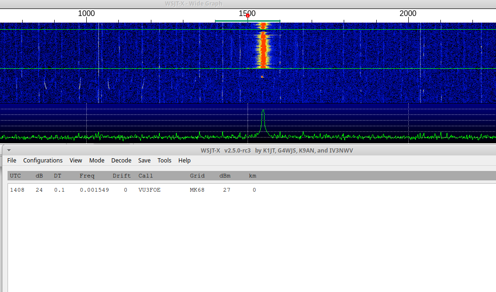
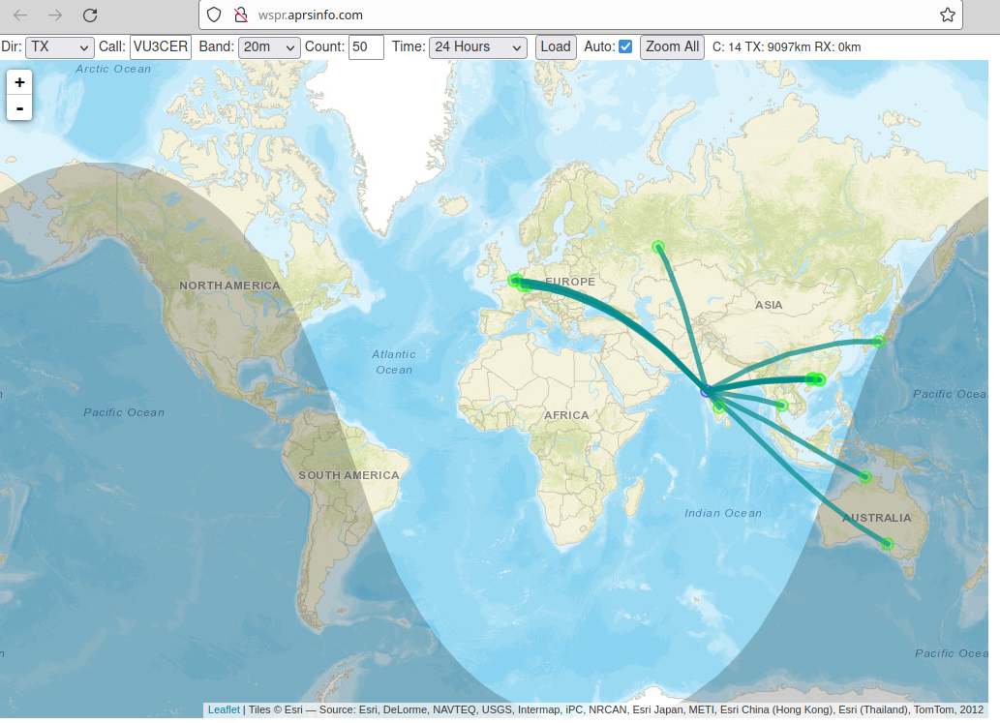
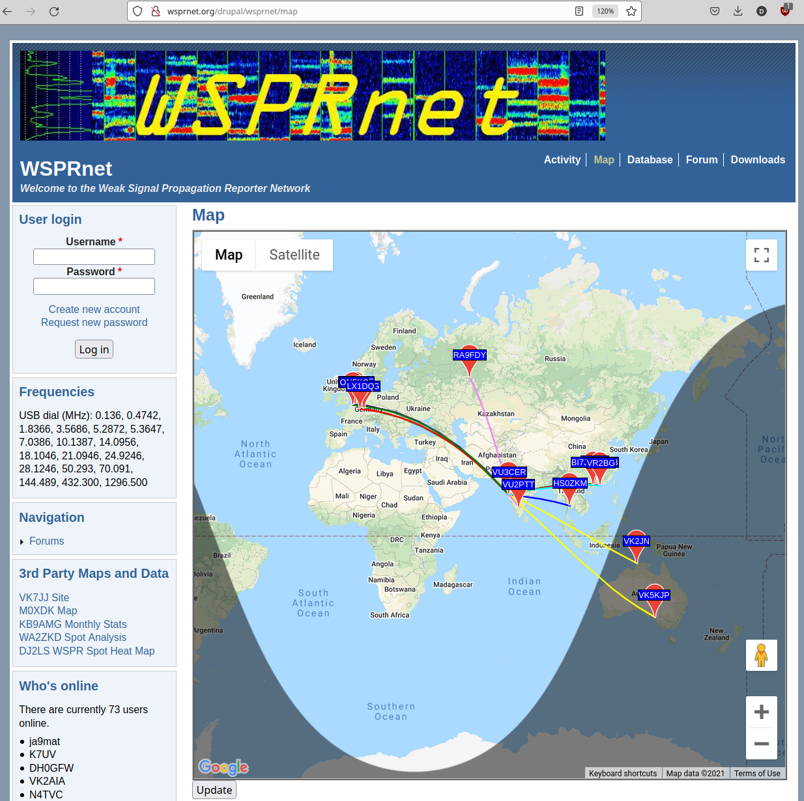

### uSDX Beacon

Alternate standalone firmware for uSDX (Barb WB2CBA V1.02) which enables FT8
and WSPR beacons!

Note: Connect the `synced` DS3231 RTC module to the `7-pin Si5351 header` on
the uSDX board.

Note 2: This minimal project comes with NO SUPPORT. It was built to find, and
test the uSDX PA gotchas. The goal of this hack is to ultimately build a
portable, hackable, reliable, and a repairable PA + Beacon system.

Note 3: Burn this alternate firmware to ATmega328P as usual by following the
uSDX docs.

Note 4: We actually don't recommend using this project unless you are ready to
do low-level debugging work completely on your own! Instead of this project,
use the fun https://github.com/kholia/Easy-Digital-Beacons-v1 project instead.

ATTENTION: Do not run this code without low-PWM setting + some active cooling
(fans!) during WSPR TX. Passive cooling is not enough for TO-92 package
devices. You have been informed ;)






Quick 7 minutes of testing on air:




Active cooling is really required for WSPR!


#### Build Steps

```
make install_arduino_cli
make install_platform
make deps

make upload  # setup for usbasp
```


#### BOM

- uSDX with working PA + LPF

- 1 x DS3231 RTC module


#### BOM Sources

- https://robu.in/

- https://www.electronicscomp.com/


#### Tips

Useful commands:

```
pacmd load-module module-null-sink sink_name=Virtual0
pacmd update-sink-proplist Virtual0 device.description=Virtual0
pacmd update-source-proplist Virtual0.monitor device.description=Virtual0
```

Note: Use Gqrx and WSJT-X with a SDR device for initial frequency adjustment /
calibration. This is essential for WSPR functionality. FT8 is more
robust/tolerant of frequency deviations due to a much larger RX window.


#### References + Credits

- WB2CBA (Barb) and Guido (PE1NNZ) - Thank you for these lovely hacking
  opportunities!

- Hans Summers (QCX and other amazing projects)

- https://github.com/threeme3/QCX-SSB/issues/32 (Support WSPR)

- https://kholia.github.io/wspr_encoder.html

- https://kholia.github.io/ft8_encoder.html

- https://github.com/etherkit/JTEncode

- http://qrp-labs.com/qcx/qcxtrouble

- https://lastminuteengineers.com/ds3231-rtc-arduino-tutorial/

- http://wsprnet.org/drupal/node/218 (WSPR Frequencies)

- https://gist.github.com/bd1es/a782e2529b8289288fadd35e407f6440 (WSPR encoder - BD1ES)

- WSJT-X project - nhash stuff, WSPR and other modes ;)
